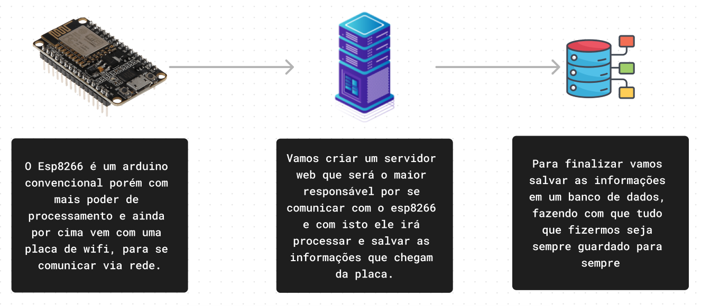
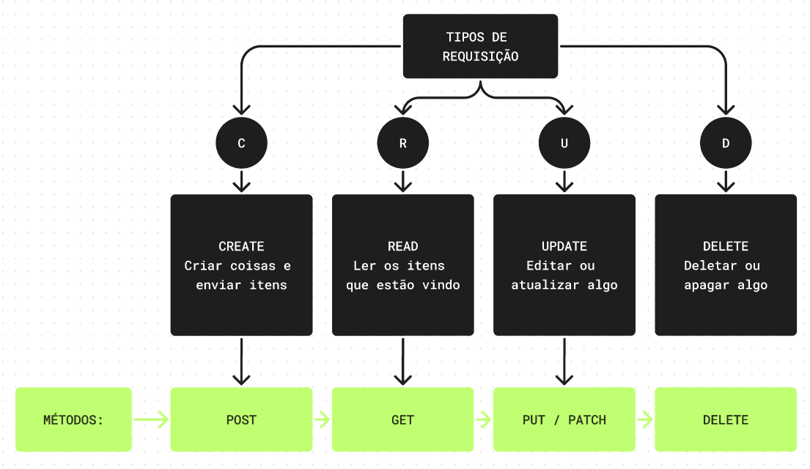
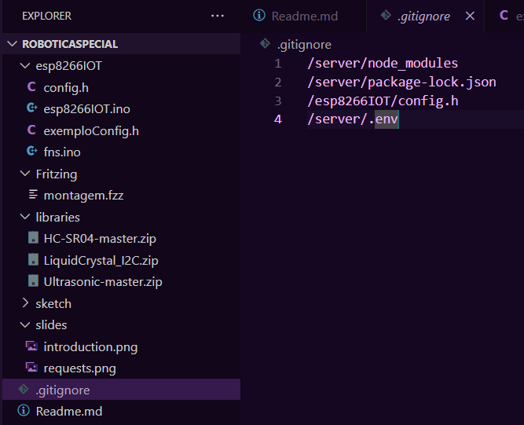
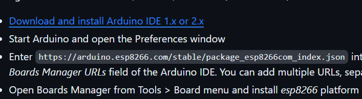
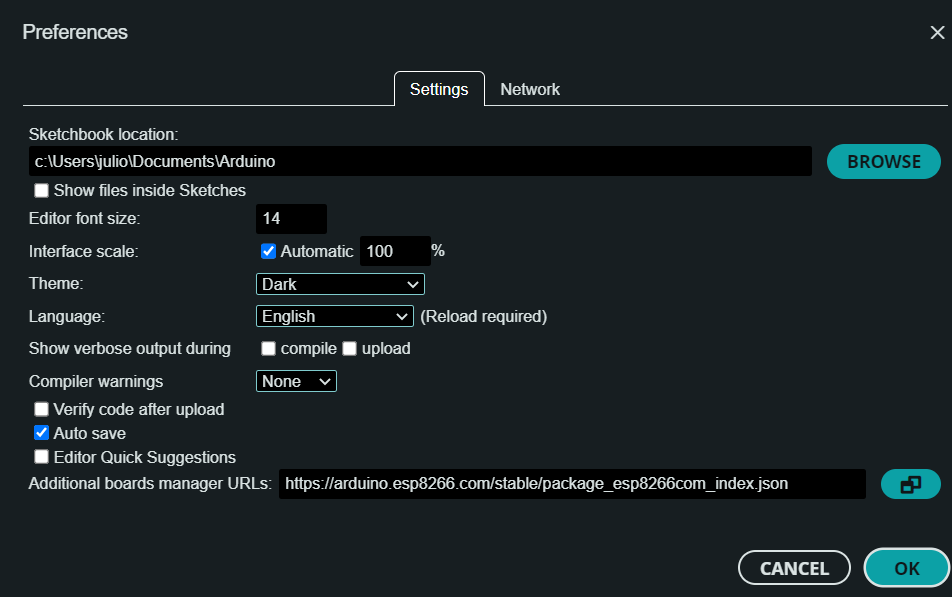
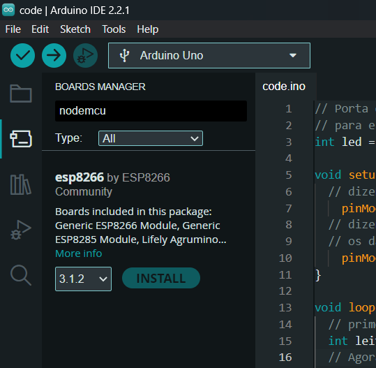
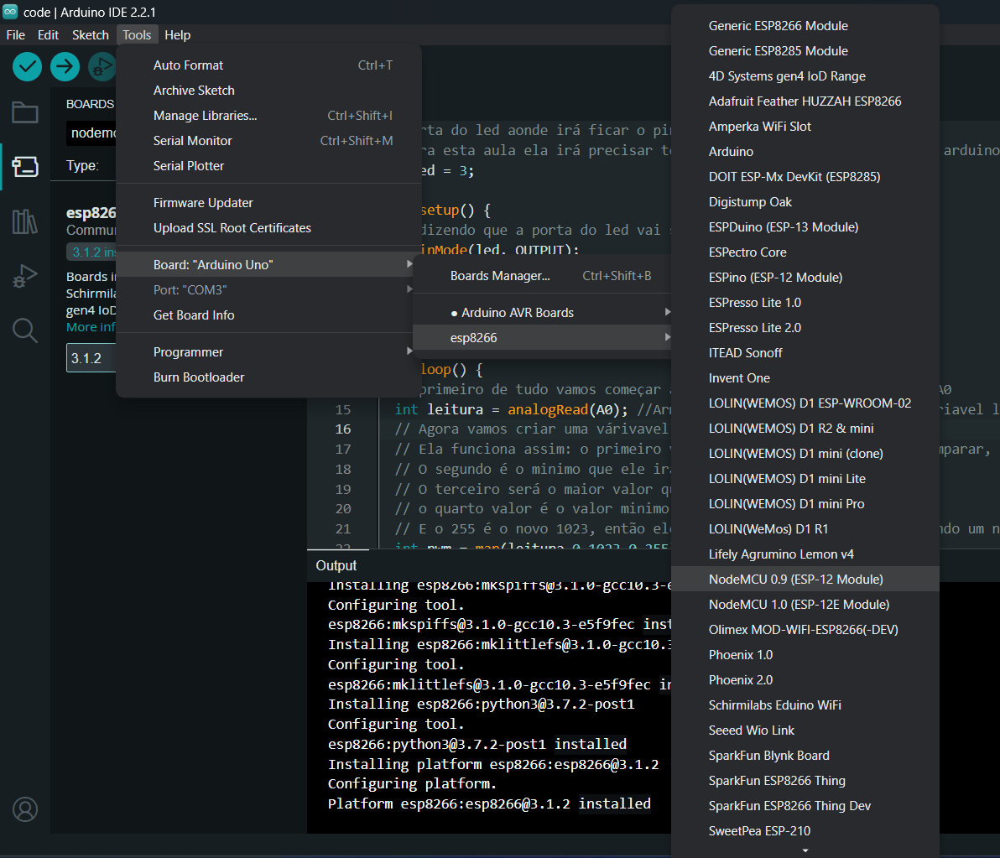

# Aula 1

### Primeiro vamos dividir a aula em 3 partes

<ol>
    <li><a href="#part1">Explicação da dinamica da aula</a></li>
    <li><a href="#part2">Montagem do circuito</a></li>
    <li><a href="#part3">Código</a></li>
    <li><a href="#part4">Explicações extras</a></li>
    <li><a href="#part5">Arrumando o arduino para se comunicar com o esp</a></li>
</ol>

### 1  Explicação da dinamica da aula 

O começo do semestre será baseado em comunicações, entendendo como funciona o projeto e como comunicações podem acontecer, entendendo um pouco mais sobre servidores e componentes, neste projeto nós vamos criar um sistema simples de comunicação para ascender o led via um servidor apenas para relembrar como funciona um servidor

Agora que quando nós trabalhamos com servidores, existem tipos de conexão que se pode fazer, um dos jeitos de se comunicar é via métodos HTTP que são requisições de web:

### 2  Montagem do circuito 

### 3  Código 

As explicações sobre o que o código faz em especifico estão documentadas em comentários então é só ir até o <a href="./esp8266IOT/esp8266IOT.ino"> código</a>

### 4  Explicações extras: 

A primeira e provavelmente a mais importante, como esta turma é a de alunos mais velhos, eles terão contas no github aonde irão hospedar o código e os sketchs do projeto. Sempre que terminarem a montagem lembre eles de montar o sketch no fritzing para usar no github e ter guardado para no futuro lembrarem de como montar, porém estamos trabalhando com uma coisa extremamente sensível que é o wifi, já que vamos ter que conectar na rede wifi precisamos esconder as informações extras e não enviar elas ao github, fazemos isso adicionando o caminho delas no .gitignore:

Agora outra coisa que é importante se atentar é que para mais segurança ainda criamos o arquivo de configuração usando o .h no final, isto nada mais é que um arquivo de extensão, chegando na etapa do código que estamos ficando, muitas vezes precisamos criar funcionalidades e ferramentas que não existem no projeto. Logo a primeira opção e provavelmente mais usada no mundo é criar um arquivo executável em outra linguagem ou extensão como a .h e converter para dentro do arquivo .ino, um exemplo de um aplicativo de camera de celular que irá rodar em react-native, que é um criador de aplicativos de celular mobile, ele é escrito em cpp com .h e redistribuido para java, kotlin, swift etc <a href="https://github.com/mrousavy/react-native-vision-camera/blob/main/package/cpp/MutableRawBuffer.cpp"> link da biblioteca</a>

Pinagem do esp8266:

### 5  Arrumando o arduino para se comunicar com o esp 

Primeiro vamos na configuração adicionar o arquivo de json das placas esp8266:

Agora ir no <a href="https://github.com/esp8266/Arduino"> github </a> para pegar o json das placas e adicionar embaixo:

E pronto agora vamos poder compilar os códigos para o esp8266
