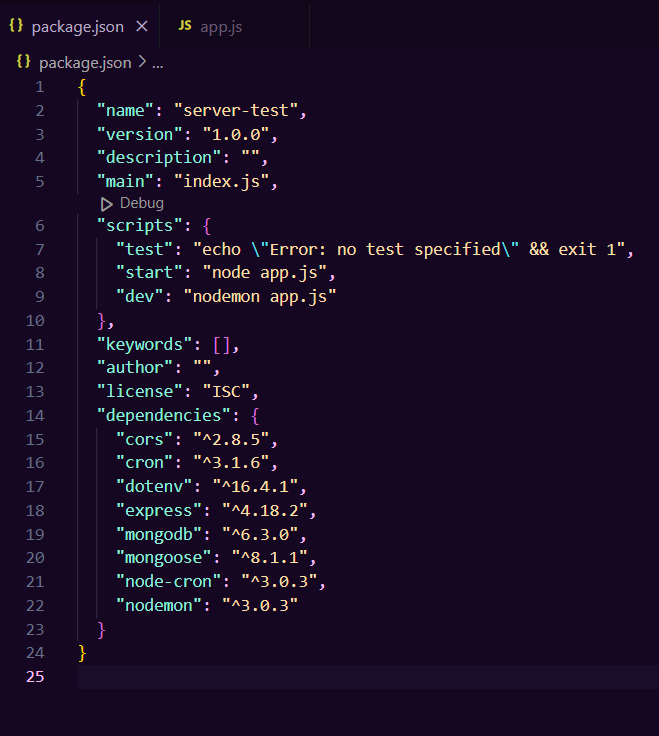
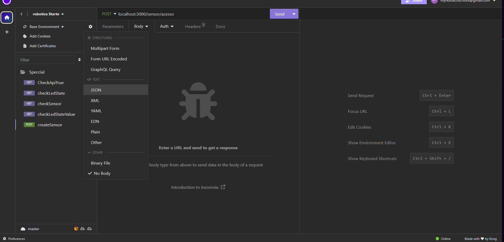

# Aula 2 - Servidor

### Primeiro vamos dividir a aula em 5 partes

<ol>
    <li><a href="#part1">Explicação da dinamica da aula</a></li>
    <li><a href="#part2">Código</a></li>
    <li><a href="#part3">Explicações extras</a></li>
    <li><a href="#part4">Como criar a pasta server:</a></li>
    <li><a href="#part5">Como criar o banco de dados:</a></li>
    <li><a href="#part6">Testando a api</a></li>
</ol>

### 1  Explicação da dinamica da aula 

Vamos criar o servidor para poder salvar os sensores de contato do nosso carrinho, então nesta aula vamos rodar um servidor na porta 3000 e tentar se comunicaar com ele

Agora que quando nós trabalhamos com servidores, existem tipos de conexão que se pode fazer, um dos jeitos de se comunicar é via métodos HTTP que são requisições de web:

Nesta aula usaremos 2 tipos de requisição o GET e o POST

### 2  Código 

As explicações sobre o que o código faz em especifico estão documentadas em comentários então é só ir até o <a href="./server/app.js"> código</a> e olhar as pastas que estão dentro do server. As unicas desnecessárias são os packages e tudo dentro do node_modules

### 3  Explicações extras: 

O servidor será um servidor nodejs que iremos subir na aula sempre precisará estar online, não é muito amigável subir o servidor no localhost:3000 e tentar acessar ele via rede wifi com placa e posicionamento de endereço, para facilitar o endereço dos alunos vamos subir online no render e acessar via http requests

### 4  Como criar a pasta server: 

Primeiro precisamos ir para uma pasta vazia:

Depois precisamos iniciar o arquivo de configuração:

Instalar todas as bibliotecas que vamos precisar:

Criar os scripts para executar o servidor:

E iniciar o servidor:

### 5  Como criar o banco de dados: 

Precisamos ir até o site do <a href="https://www.mongodb.com/atlas/database"> mongoDB </a> e registrar com o GMAIL do aluno, caso o aluno não tenha um gmail próprio o professor pode criar

Criar um banco de dados <b>SEMPRE GRATUITO</b>

Escolher a região de são paulo e dar um nome:

Caso já tenha um banco criado etc para criar um novo é só ir ali no novo projeto:

Crie um usuário para usar o banco de dados. Não adianta usar o meu usuário irei deletar o banco após o tutorial

Permita que qualquer IP possa acessar o banco de dados, assim o esp8266 pode se comunicar com o banco:

Agora clique para se conectar ao banco

Vamos clicar em drivers

Copiar o link do banco:

E configurar o .env do projeto:

Agora para finalizar quando iniciar o servidor, se tudo deu certo verá que o banco de dados está conectado:

### 6  Testando a api 

Para Testar a api vamos usar o app <a href="https://insomnia.rest/download">insomnia</a>:

Vamos primeiro de tudo criar uma requisição do tipo GET para pegar os dados em http://localhost:3000/api . Não podemos esquecer que o servidor tem que estar rodando:

Agora vamos testar se a rota do led está funcionando:

Vamos checar agora o sinal do led se está apagado(false) ou aceso(true)

Repare que também poderá trocar o valor recebido na direita:

Agora vamos testar se a rota do sensor está funcionando:

Vamos criar um tipo de requisição POST igual está na <a href="./server/routes/sensorRoutes.js"> rota de acesso do sensor</a> para isso precisamos de um body, para colocar um corpo na requisição, ou seja as informações que queremos passar, que será um formato conhecido como json:

Preenchendo o json e enviando já recebemos a confirmação que foi salvo no banco:

Para confirmar se realmente foi salvo no banco vamos até ele checar, e já vemos que realmente agora existe um gráfico de mensagens:

E por fim indo até as collections do banco, aonde é armazenado os dados já temos o dado lá:

